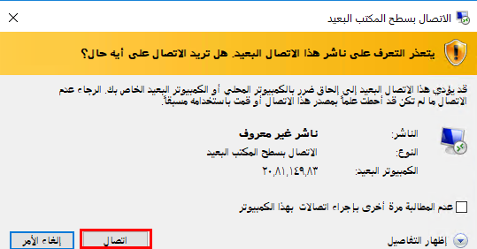
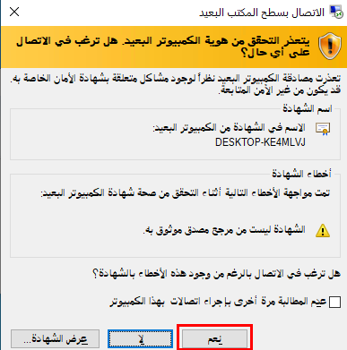
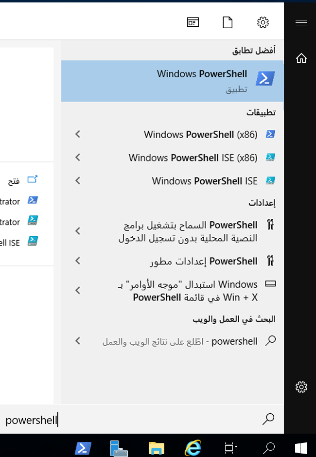

<div id="readme" class="Box-body readme blob js-code-block-container p-5 p-xl-6 gist-border-0" dir="rtl">
    <article class="markdown-body entry-content container-lg" itemprop="text"><table>
  <thead>
  <tr>
  <th>wts</th>
  </tr>
  </thead>
  <tbody>
  <tr>
  <td><div><table>
  <thead>
  <tr>
  <th>title</th>
  <th>module</th>
  </tr>
  </thead>
  <tbody>
  <tr>
  <td><div>01 - إنشاء جهاز ظاهري في المدخل (10 دقائق)</div></td>
  <td><div>الوحدة 02 - خدمات Azure الأساسية (أحمال العمل)</div></td>
  </tr>
  </tbody>
</table>
</div></td>
  </tr>
  </tbody>
</table>
       
# 01 - إنشاء جهاز ظاهري في المدخل (10 دقائق)

في هذه المعاينة، سننشئ جهازًا ظاهريًا في مدخل Azure ونتصل بالجهاز الظاهري ونثبت دور خادم الويب ونختبره. 

**ملاحظة**: خذ الوقت الكافي أثناء مطالعة هذا الدليل للنقر فوق الأيقونات المعلوماتية وقراءتها. 

# المهمة 1: إنشاء جهاز ظاهري 
1. سجّل الدخول إلى مدخل Azure: **https://portal.azure.com**

3. من نافذة **كل الخدمات** في قائمة المدخل، ابحث عن **الأجهزة الظاهرية** وحددها، ثم انقر فوق **+ إضافة أو + إنشاء أو + جديد** واختر **+جهاز ظاهري** من القائمة المنسدلة.

4. في علامة تبويب **الأساسيات**، اكتب المعلومات التالية (اترك الإعدادات الافتراضية لكل شيء آخر):

    | إعدادات | القيم |
    |  -- | -- |
    | الاشتراك | **استخدام الإعداد الافتراضي المقدم.** |
    | مجموعة الموارد | **أنشئ مجموعة موارد جديدة** |
    | اسم الجهاز الظاهري | **myVM** |
    | المنطقة | **(الولايات المتحدة) شرق الولايات المتحدة**|
    | خيارات التوفر | لا توجد خيارات تكرار للبنية الأساسية مطلوبة|
    | الصورة | **مركز بيانات Windows Server 2019 - Gen2**|
    | الحجم | **D2s v3 قياسي**|
    | اسم مستخدم حساب المسؤول | **مستخدم Azure** |
    | كلمة مرور حساب المسؤول (اكتبها بحرص!) | **Pa$$w0rd1234**|
    | قواعد منفذ الوارد - | **السماح بمنافذ محددة**|
    | تحديد منافذ الوارد | **RDP (3389)** و**HTTP (80)**| 

5. قم بالتبديل إلى علامة التبويب الشبكات للتأكد من تحديد **HTTP (80) وRDP (3389)** في القسم تحديد **منافذ الوارد**.

6. قم بالتبديل إلى علامة تبويب الإدارة، وفي قسم **المراقبة** ضمنها، حدد الإعداد التالي:

    | إعدادات | القيم |
    | -- | -- |
    | سجل تشخيص التمهيد | **تعطيل**|

7. اترك القيم المتبقية على الإعدادات الافتراضية ثم انقر فوق زر **مراجعة + إنشاء** في أسفل الصفحة.

8. بمجرد اجتياز التحقق من الصحة، انقر فوق زر **إنشاء**. يمكن أن يستغرق توزيع الجهاز الظاهري ما بين خمس إلى سبع دقائق.

9. ستتلقى تحديثات على صفحة التوزيع وعبر منطقة **الإعلامات** (أيقونة الجرس في شريط القائمة العلوية).

# المهمة 2: الاتصال بالجهاز الظاهري

في هذه المهمة، سنتصل بجهازنا الظاهري الجديد باستخدام RDP (بروتوكول سطح المكتب البعيد). 

1. انقر فوق رمز الجرس من شريط الأدوات العلوي الأزرق، وحدد "الانتقال إلى المورد" بعد نجاح عملية التوزيع. 

    **ملاحظة**: يمكنك أيضًا استخدام ارتباط **الانتقال إلى المورد** في صفحة التوزيع. 

2. في نافذة **نظرة عامة** على الجهاز الظاهري، انقر فوق زر **اتصال** واختر **RDP** من القائمة المنسدلة.

    

    **ملاحظة**: تخبرك الإرشادات التالية بكيفية الاتصال بجهازك الظاهري من جهاز كمبيوتر يعمل بنظام Windows. على جهاز Mac، تحتاج إلى عميل RDP مثل عميل سطح المكتب البعيد هذا من متجر Mac App Store وعلى جهاز كمبيوتر يعمل بنظام تشغيل Linux، يمكنك استخدام عميل RDP مفتوح المصدر.

2. من صفحة **الاتصال بالجهاز الظاهري**، احتفظ بالخيارات الافتراضية للاتصال بعنوان IP العام عبر المنفذ 3389 وانقر فوق **تنزيل ملف RDP**. سيتم تنزيل ملف في الجزء السفلي الأيسر من الشاشة.

3. **افتح** ملف RDP الذي تم تنزيله (الموجود في الجزء السفلي الأيسر من جهاز النشاط المعملي خاصتك) وانقر فوق **اتصال** عندما يُطلب منك ذلك. 

    

4. في نافذة **أمان Windows**، قم بتسجيل الدخول باستخدام بيانات اعتماد المسؤول التي استخدمتها عند إنشاء **azureuser** للجهاز الظاهري وكلمة المرور **Pa$$w0rd1234**. 

5. قد تتلقى شهادة تحذير أثناء عملية تسجيل الدخول. انقر فوق **نعم** أو لإنشاء الاتصال والاتصال بالجهاز الظاهري الموزَع. ينبغي لك الاتصال بنجاح.

    

سيتم إطلاق جهاز افتراضي جديد (myVM) داخل نشاطك المعملي. أغلق مدير الخادم ونوافذ لوحة المعلمات المنبثقة (انقر فوق "x" في أعلى اليمين). من المفترض أن ترى الخلفية الزرقاء لجهازك الظاهري. **تهانينا!** لقد قمت بالنشر والاتصال بجهاز ظاهري يعمل بنظام التشغيل Windows Server. 

# المهمة 3: تثبيت دور خادم الويب واختباره

في هذه المهمة، ثبّت دور خادم الويب على الخادم على الجهاز الظاهري الذي أنشأته للتو وتأكد من إمكانية عرض صفحة ترحيب خدمات معلومات الانترنت الافتراضية. 

1. في الجهاز الظاهري الذي تم فتحه حديثًا، قم بتشغيل PowerShell بالبحث عن **PowerShell** في شريط البحث، وعند العثور عليه، انقر بزر الماوس الأيمن فوق **Windows PowerShell** **للتشغيل كمسؤول**.

    

2. في PowerShell، ثبّت ميزة **خادم الويب** في الجهاز الظاهري عن طريق تشغيل الأمر التالي. (الصق الأمر واضغط على ENTER لبدء عملية التثبيت).

    ```PowerShell
    Install-WindowsFeature -name Web-Server -IncludeManagementTools
    ```
  
3. عند الانتهاء، سيكون هناك مطالبة تفيد **تمت العملية بنجاح** بقيمة **صواب**. لا تحتاج إلى إعادة تشغيل الجهاز الظاهري لإكمال التثبيت. أغلق اتصال RDP بالجهاز الظاهري بالنقر فوق **x** على الشريط الأزرق في منتصف الجزء العلوي من جهازك الظاهري. يمكنك أيضًا تصغيره بالنقر فوق **-** على الشريط الأزرق في منتصف الجزء العلوي.

    

4. بالعودة إلى المدخل، انتقل مرة أخرى إلى نافذة **نظرة عامة** من myVM، واستخدام زر **انقر فوق الحافظة** لنسخ عنوان IP العام في myVM، ثم افتح علامة تبويب جديدة في المستعرض والصق عنوان IP العام في مربع نص URL واضغط على مفتاح **إدخال** لاستعراضه.

    

5. سيتم عرض صفحة الترحيب الافتراضية لخادم ويب خدمات معلومات الانترنت.

    

**تهانينا!** لقد أنشأتَ جهاز ظاهري جديد يعمل على خادم ويب يمكن الوصول إليه عبر عنوان IP العام الخاص به. إذا كان لديك تطبيق ويب لاستضافته، فيمكنك توزيع ملفات التطبيق على الجهاز الظاهري واستضافتها للوصول العام على الجهاز الظاهري الموزَع.


**ملاحظة**: لتجنب التكاليف الإضافية، يمكنك إزالة مجموعة الموارد هذه اختياريًا. ابحث عن مجموعات الموارد، وانقر فوق مجموعة الموارد الخاصة بك، ثم انقر فوق **حذف مجموعة الموارد**. تحقق من اسم مجموعة الموارد ثم انقر فوق **حذف**. راقب **الإعلامات** لترى كيف تجري عملية الحذف.
