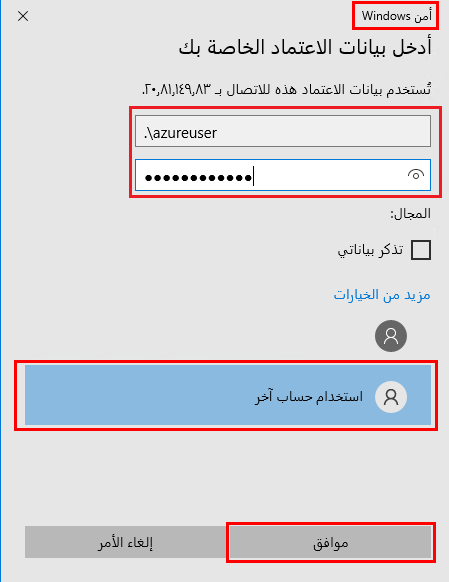

---
wts:
   title: '01 - إنشاء جهاز ظاهري في المدخل (10 دقائق)'
   module: 'الوحدة 02 - خدمات Azure الأساسية (أحمال العمل)'
---
# 01 - إنشاء جهاز ظاهري في المدخل

في هذه المعاينة، سننشئ جهازًا ظاهريًا في مدخل Azure ونتصل بالجهاز الظاهري ونثبت دور خادم الويب ونختبره. 

**ملاحظة**: خذ الوقت الكافي أثناء مطالعة هذا الدليل للنقر فوق الأيقونات المعلوماتية وقراءتها. 

# المهمة 1: إنشاء الجهاز الظاهري (10 دقائق)

في هذه المهمة، سننشئ جهازًا ظاهريًا لمركز بيانات Windows Server 2019 - الجهاز الظاهري Gen1. 

1. سجّل الدخول إلى [مدخل Azure (https://portal.azure.com)](https://portal.azure.com?azure-portal=true).

2. من نافذة **جميع الخدمات**، ابحث عن **الأجهزة الظاهرية** وحددها، ثم انقر فوق **+ إضافة** واختر **+ جهاز ظاهري**.

3. في علامة تبويب **الأساسيات**، اكتب المعلومات التالية (اترك الإعدادات الافتراضية لكل شيء آخر):

    | إعدادات | القيم |
    |  -- | -- |
    | الاشتراك | **اختر اشتراكك**|
    | مجموعة الموارد | **myRGVM** (إنشاء جديد) |
    | اسم الجهاز الظاهري | **myVm** |
    | الموقع | **(الولايات المتحدة) شرق الولايات المتحدة**|
    | الصورة | **مركز بيانات Windows Server 2019 - Gen1**|
    | الحجم | D2s v3 قياسي|
    | اسم مستخدم حساب المسؤول | **مستخدم Azure** |
    | كلمة مرور حساب المسؤول | **Pa$$w0rd1234**|
    | قواعد منفذ الوارد - السماح بمنافذ محددة | **RDP (3389)** و**HTTP (80)**|
    | | |

4. قم بالتبديل إلى علامة تبويب "الشبكة"، وابحث عن **تحديد منافذ الوارد**:

    | إعدادات | القيم |
    | -- | -- |
    | تحديد منافذ الوارد | **HTTP (80)، RDP (3389)**|
    | | |

    **ملحوظة** -  تحقق من تحديد كلا المنفذين 80 و3389

5. قم بالتبديل إلى علامة تبويب الإدارة، وفي قسم **المراقبة** ضمنها، حدد الإعداد التالي:

    | إعدادات | القيم |
    | -- | -- |
    | سجل تشخيص التمهيد | **تعطيل**|
    | | |

6. اترك الإعدادات الافتراضية المتبقية ثم انقر فوق زر **مراجعة + إنشاء** في أسفل الصفحة.

7. بمجرد اجتياز التحقق من الصحة، انقر فوق زر **إنشاء**. يمكن أن يستغرق توزيع الجهاز الظاهري ما بين خمس إلى سبع دقائق.

8. ستتلقى تحديثات على صفحة التوزيع وعبر منطقة **الإعلامات** (أيقونة الجرس في القائمة العلوية).

* **تحقق من فتح المنفذ 80 و3389**

# المهمة 2: الاتصال بالجهاز الظاهري

في هذه المهمة، سنتصل بجهازنا الظاهري الجديد باستخدام RDP. 

1. ابحث عن **myVM** وحدد جهازك الظاهري الجديد.

    **ملاحظة**: يمكنك أيضًا استخدام ارتباط **الانتقال إلى المورد** في صفحة التوزبع أو ارتباط المورد في منطقة **الإعلامات**.

2. في نافذة **نظرة عامة** على الجهاز الظاهري، انقر فوق زر **اتصال** واختر **RDP**.

    

    **ملاحظة**: تخبرك الإرشادات التالية بكيفية الاتصال بجهازك الظاهري من جهاز كمبيوتر يعمل بنظام Windows. على جهاز Mac، تحتاج إلى عميل RDP مثل عميل سطح المكتب البعيد هذا من متجر Mac App Store وعلى جهاز كمبيوتر يعمل بنظام تشغيل Linux، يمكنك استخدام عميل RDP مفتوح المصدر.

2. في صفحة **الاتصال بالجهاز الظاهري**، احتفظ بالخيارات الافتراضية للاتصال بعنوان IP العام عبر المنفذ 3389 وانقر فوق **تنزيل ملف RDP**.

3. **افتح** ملف RDP الذي تم تنزيله وانقر فوق **اتصال** عندما يُطلب منك ذلك. 

    

4. في نافذة **أمان Windows**، حدد **المزيد من الخيارات** ثم **استخدام حساب مختلف**. أدخل اسم المستخدم (.\azureuser) وكلمة المرور (Pa$$w0rd1234). انقر فوق **موافق** للاتصال.

    

5. قد تتلقى تحذير شهادة أثناء عملية تسجيل الدخول. انقر فوق **نعم** أو لإنشاء الاتصال والاتصال بالجهاز الظاهري الموزَع. ينبغي لك الاتصال بنجاح.

    

تهانينا! لقد قمت بالتوزيع والاتصال بجهاز ظاهري يعمل بنظام Windows Server في Azure

# المهمة 3: تثبيت دور خادم الويب واختباره

في هذه المهمة، ثبّت دور خادم الويب على الخادم وتأكد من إمكانية عرض صفحة ترحيب خدمات معلومات الانترنت الافتراضية.

1. افتح موجه أوامر PowerShell على الجهاز الظاهري، بالنقر فوق زر **ابدأ**، وكتابة **PowerShell** والنقر بزر الماوس الأيمن فوق **Windows PowerShell** وتحديد **تشغيل كمسؤول** في قائمة النقر بزر الماوس الأيمن.

    

2. ثبّت ميزة **خادم الويب** في الجهاز الظاهري عن طريق تشغيل الأمر التالي في موجه أوامر PowerShell. يمكنك نسخ ولصق هذا الأمر.

    ```PowerShell
    Install-WindowsFeature -name Web-Server -IncludeManagementTools
    ```
  
3. عند الانتهاء، سيكون هناك مطالبة تفيد **تمت العملية بنجاح** بقيمة **صواب**. لا تحتاج إلى إعادة تشغيل الجهاز الظاهري لإكمال التثبيت. أغلق اتصال RDP بالجهاز الظاهري.

    

4. بالعودة إلى المدخل، انتقل مرة أخرى إلى نافذة **نظرة عامة** من myVM، واستخدام زر **انقر فوق الحافظة** لنسخ عنوان IP العام في myVM، وافتح علامة تبويب جديدة في المستعرض والصق عنوان IP العام في مربع نص URL واضغط على مفتاح **إدخال** لاستعراضه.

    

5. سيتم فتح صفحة الترحيب الافتراضية لخادم ويب خدمات معلومات الانترنت.

    

تهانينا! لقد أنشأتَ خادم ويب يمكن الوصول إليه عبر عنوان IP العام الخاص به. إذا كان لديك تطبيق ويب لاستضافته، فيمكنك توزيع ملفات التطبيق على الجهاز الظاهري واستضافتها للوصول العام على الجهاز الظاهري الموزَع.


**ملاحظة**: لتجنب التكاليف الإضافية، يمكنك إزالة مجموعة الموارد هذه. ابحث عن مجموعات الموارد، وانقر فوق مجموعة الموارد الخاصة بك، ثم انقر فوق **حذف مجموعة الموارد**. تحقق من اسم مجموعة الموارد ثم انقر فوق **حذف**. راقب **الإعلامات** للتحقق من اكتمال الحذف بنجاح. 
