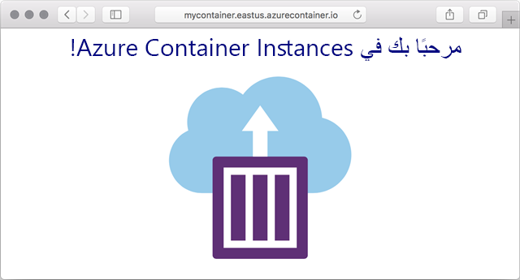



    <article class="markdown-body entry-content container-lg" itemprop="text"><table>
  <thead>
  <tr>
  <th>wts</th>
  </tr>
  </thead>
  <tbody>
  <tr>
  <td>
<table>
  <thead>
  <tr>
  <th>title</th>
  <th>module</th>
  </tr>
  </thead>
  <tbody>
  <tr>
  <td>
03 - توزيع مثيلات حاوية Azure (10 دقائق)
</td>
  <td>
الوحدة 02 - خدمات Azure الأساسية (أحمال العمل)
</td>
  </tr>
  </tbody>
</table>

</td>
  </tr>
  </tbody>
</table>

# 03 - توزيع مثيلات حاوية Azure (10 دقائق)

في هذه المعاينة، نُنشئ ونكوّنها ونوزعها باستخدام مثيلات حاوية Azure (ACI) في مدخل Azure. الحاوية عبارة عن تطبيق ويب مثيلات حاوية Azure يعرض صفحة HTML ثابتة. 

# المهمة 1: قم بإنشاء مثيل حاوية 

في هذه المهمة، سننشئ مثيل حاوية جديد لتطبيق الويب. 

1. تسجيل الدخول إلى [مدخل Azure](https://portal.azure.com).

2. من نافذة **جميع الخدمات**، ابحث عن **مثيلات الحاوية** وحددها، ثم انقر فوق **+ إضافة، + إنشاء، + جديد**. 

3. قدّم التفاصيل الأساسية التالية لمثيل الحاوية الجديد (اترك القيم الافتراضية لكل شيء آخر)): 

	| الإعداد| القيمة|
	|----|----|
	| الاشتراك | ***استخدام الإعداد الافتراضي المقدم.*** |
	| مجموعة الموارد | **أنشئ مجموعة موارد جديدة** |
	| اسم الحاوية| **mycontainer**|
	| المنطقة | **(الولايات المتحدة) شرق الولايات المتحدة** |
	| مصدر الصورة| **مركز Docker أو سجل آخر**|
	| نوع الصورة| **عام**|
	| الصورة| **mcr.microsoft.com/azuredocs/aci-helloworld**|
	| نوع نظام التشغيل| **Linux** |
	| الحجم| ***اترك الإعداد الافتراضي***|

4. كوّن علامة تبويب "الشبكة" (استبدل **xxxx** بأحرف وأرقام بحيث يكون الاسم فريدًا بشكلٍ عام). اترك جميع الإعدادات الأخرى في قيمها الافتراضية.

	| الإعداد| القيمة|
	|--|--|
	| تسمية اسم DNS| **mycontainerdnsxxxxx** |

	
	**ملاحظة**: يمكن الوصول إلى حاويتك بشكلٍ عام على dns-name-label.region.azurecontainer.io. إذا تلقيت رسالة خطأ **تسمية اسم DNS غير متوفرة** بعد التوزيع، فحدد تسمية اسم DNS مختلفة (استبدل xxxx) وأعد التوزيع. 

5. انقر فوق **مراجعة وإنشاء** لبدء عملية التحقق التلقائي.

6. انقر فوق **إنشاء** لإنشاء مثيل الحاوية. 

7. راقب صفحة التوزيع وصفحة **الإعلامات**. 

# المهمة 2: التحقق من توزيع مثيل الحاوية

في هذه المهمة، نتحقق من تشغيل مثيل الحاوية عن طريق التأكد من عرض صفحة الترحيب.

1. بعد اكتمال التوزيع، انقر فوق ارتباط **الانتقال إلى المورد** في نافذة التوزيع أو ارتباط المورد في منطقة الإعلامات.

2. في نافذة **نظرة عامة** في **mycontainer**، تأكد من أن **حالة** حاويتك **قيد التشغيل**. 

3. حدد موقع اسم مجال مؤهل بالكامل (FQDN).

	

2. انسخ FQDN الخاص بالحاوية في علامة تبويب جديدة واضغط على **إدخال**. ينبغي عرض صفحة الترحيب. 

	

**تهانينا!** لقد استخدمت مدخل Azure لتوزيع تطبيق بنجاح في حاوية في مثيلات حاوية Azure.

**ملاحظة**: لتجنب التكاليف الإضافية، يمكنك إزالة مجموعة الموارد هذه اختياريًا. ابحث عن مجموعات الموارد، وانقر فوق مجموعة الموارد الخاصة بك، ثم انقر فوق **حذف مجموعة الموارد**. تحقق من اسم مجموعة الموارد ثم انقر فوق **حذف**. راقب **الإعلامات** لترى كيف تجري عملية الحذف.
