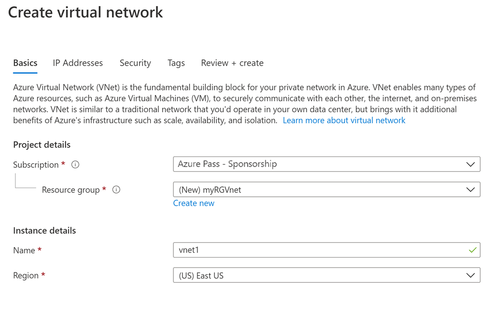
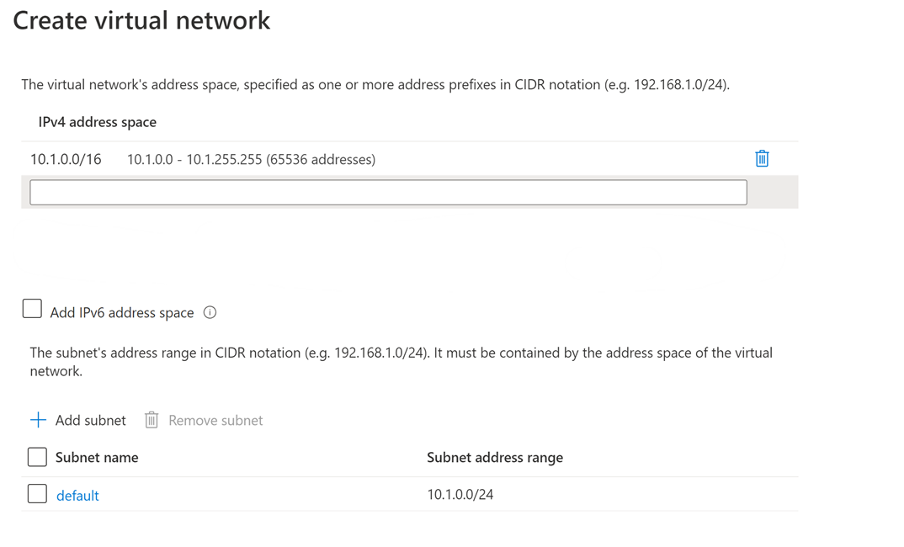

<div id="readme" class="Box-body readme blob js-code-block-container p-5 p-xl-6 gist-border-0" dir="rtl">
    <article class="markdown-body entry-content container-lg" itemprop="text"><table>
  <thead>
  <tr>
  <th>wts</th>
  </tr>
  </thead>
  <tbody>
  <tr>
  <td><div><table>
  <thead>
  <tr>
  <th>title</th>
  <th>module</th>
  </tr>
  </thead>
  <tbody>
  <tr>
  <td><div>04 - إنشاء شبكة ظاهرية (20 دقيقة)</div></td>
  <td><div>الوحدة 02 - خدمات Azure الأساسية (أحمال العمل)</div></td>
  </tr>
  </tbody>
</table>
</div></td>
  </tr>
  </tbody>
</table>
       
# 04 - إنشاء شبكة ظاهرية

في هذه المعاينة، سننشئ شبكة ظاهرية، ونوزع جهازين ظاهريين على تلك الشبكة الظاهرية، ثم نسمح لجهاز ظاهري واحد بإجراء اختبار اتصال للآخر داخل تلك الشبكة الظاهرية.

# المهمة 1: إنشاء شبكة ظاهرية (20 دقيقة)

في هذه المهمة، سننشئ شبكة ظاهرية. 

1. سجّل الدخول إلى مدخل Azure على <a href="https://portal.azure.com" target="_blank"><span style="color: #0066cc;" color="#0066cc">https://portal.azure.com</span></a>

2. من نافذة **جميع الخدمات**، ابحث عن **الشبكات الظاهرية** وحددها، ثم انقر فوق **+ إضافة أو + إنشاء أو + جديد**. 

3. في نافذة **إنشاء شبكة ظاهرية**، اكتب المعلومات التالية (اترك الإعدادات الافتراضية لكل شيء آخر):

    | الإعداد | القيمة | 
    | --- | --- |
    | الاشتراك | **حدد اشتراكك** |
    | مجموعة الموارد | **myRGVNet** (إنشاء جديد) |
    | الاسم | **vnet1** |
    | الموقع | **(الولايات المتحدة) شرق الولايات المتحدة** |
    | مساحة العنوان |**10.1.0.0/16** |
    | الشبكة الفرعية - الاسم | **default** |
    | نطاق عنوان الشبكة الفرعية | **10.1.0.0/24** |

    
    

5. انقر فوق زر **مراجعة + إنشاء**. تأكد إجراء عملية التحقق من الصحة.

6. انقر فوق زر **إنشاء** لتوزيع الشبكة الظاهرية. 

    **ملاحظة**: في مؤسستك، كيف ستعرف الشبكات الظاهرية وعناوين IP التي ستحتاج إليها؟

# المهمة 2: إنشاء جهازين ظاهريين

في هذه المهمة، سننشئ جهازين ظاهريين في الشبكة الظاهرية. 

1. من نافذة **جميع الخدمات**، ابحث عن **الأجهزة الظاهرية**، ثم انقر فوق **+ إضافة** واختر **+ جهاز ظاهري**. 

2. في علامة تبويب **الأساسيات**، اكتب المعلومات التالية (اترك الإعدادات الافتراضية لكل شيء آخر):

   | الإعداد | القيمة | 
   | --- | --- |
   | الاشتراك | **اختر اشتراكك**  |
   | مجموعة الموارد |  **myRGVNet** |
   | اسم الجهاز الظاهري | **vm1**|
   | المنطقة | **(الولايات المتحدة) شرق الولايات المتحدة** |
   | الصورة | **مركز بيانات Windows Server 2019** |
   | اسم المستخدم| **مستخدم Azure** |
   | كلمة المرور| **Pa$$w0rd1234** |
   | منافذ الوارد العامة| حدد **السماح بالمنافذ المحددة**  |
   | منافذ الوارد المحددة| **RDP (3389)** |
   |||

3. حدد علامة تبويب **الشبكة**. تأكد من وضع الجهاز الظاهري في الشبكة الظاهرية vnet1. راجع الإعدادات الظاهرية، ولكن لا تُجرِ أي تغييرات أخرى. 

   | الإعداد | القيمة | 
   | --- | --- |
   | شبكة ظاهرية | **vnet1** |
   |||

4. انقر فوق **مراجعة + إنشاء**. بعد اجتياز عملية التحقق، انقر فوق **إنشاء**. يمكن أن تختلف أوقات التوزيع ولكن قد يستغرق التوزيع بشكلٍ عام ما بين ثلاث إلى ست دقائق.

5. راقب التوزيع الخاص بك، لكن تابع إلى الخطوة التالية. 

6. أنشئ جهازًا ظاهريًا ثانيًا عن طريق تكرار الخطوات **من 2 إلى 4** الموضحة أعلاه. تأكد من استخدام اسم جهاز ظاهري مختلف، وأن الجهاز الظاهري موجود داخل الشبكة الظاهرية نفسها، وأنه يستخدم عنوان IP عام جديد:

    | الإعداد | القيمة |
    | --- | --- |
    | مجموعة الموارد | **myRGVNet** |
    | اسم الجهاز الظاهري |  **vm2** |
    | شبكة ظاهرية | **vnet1** |
    | عنوان IP عام | (جديد) **vm2-ip** |
    |||

7. انتظر لحين توزيع كلا الجهازين الظاهريين. 

# المهمة 3: اختبار الاتصال 

في هذه المهمة، سنتيح تسجيل الدخول إلى جهاز ظاهري واحد ونختبر الاتصال على الآخر. 

1. من نافذة **جميع الموارد**، ابحث عن **vm1**، وافتح نافذة **نظرة عامة**، وتأكد من أن **حالتها** **قيد التشغيل**. قد تحتاج إلى **تحديث** الصفحة.

2. في نافذة **نظرة عامة**، انقر فوق زر **اتصال**.

    **ملاحظة**: تخبرك الإرشادات التالية بكيفية الاتصال بجهازك الظاهري من جهاز كمبيوتر يعمل بنظام Windows. 

3. في نافذة **الاتصال بالجهاز الظاهري**، احتفظ بالخيارات الظاهرية للاتصال بعنوان IP عبر المنفذ 3389 وانقر فوق **تنزيل ملف RDP**.

4. افتح ملف RDP الذي تم تنزيله وانقر فوق **اتصال** عندما يُطلب منك ذلك. 

5. في نافذة **أمان Windows**، اكتب اسم المستخدم **azureuser** وكلمة المرور **Pa$$w0rd1234** ثم انقر فوق **موافق**.

6. قد تتلقى تحذير شهادة أثناء عملية تسجيل الدخول. انقر فوق **نعم** أو لإنشاء الاتصال والاتصال بالجهاز الظاهري الموزَع. ينبغي لك الاتصال بنجاح.

7. افتح موجه أوامر PowerShell على الجهاز الظاهري، بالنقر فوق زر **ابدأ**، وكتابة **PowerShell** والنقر بزر الماوس الأيمن فوق **Windows PowerShell** في قائمة النقر بزر الماوس الأيمن، والنقر فوق **تشغيل كمسؤول**

8. في Powershell، اكتب الأمر التالي لمحاولة التواصل مع vm2، ستلاحظ إتمام الأمر بنجاح.

   ```PowerShell
   ping vm2
   ```

تهانينا! لقد قمت بتكوين وتوزيع جهازين ظاهريين في شبكة ظاهرية. وقد اختبرت أنه يمكنك التواصل بين الجهازين الظاهريين. 

**ملاحظة**: لتجنب التكاليف الإضافية، يمكنك إزالة مجموعة الموارد هذه. ابحث عن مجموعات الموارد، وانقر فوق مجموعة الموارد الخاصة بك، ثم انقر فوق **حذف مجموعة الموارد**. تحقق من اسم مجموعة الموارد ثم انقر فوق **حذف**. راقب **الإعلامات** لترى كيف تجري عملية الحذف.
