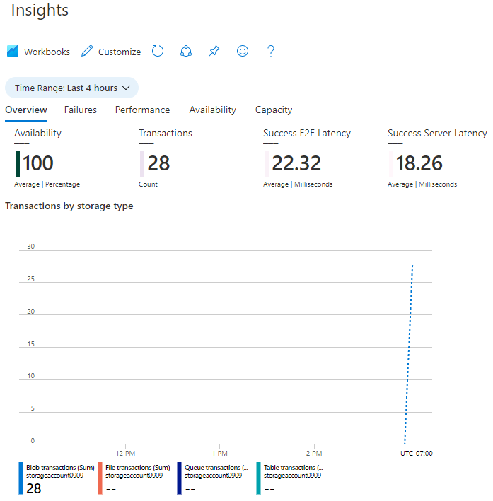



    <article class="markdown-body entry-content container-lg" itemprop="text"><table>
  <thead>
  <tr>
  <th>wts</th>
  </tr>
  </thead>
  <tbody>
  <tr>
  <td>
<table>
  <thead>
  <tr>
  <th>title</th>
  <th>module</th>
  </tr>
  </thead>
  <tbody>
  <tr>
  <td>
05 - إنشاء مخزن البيانات الثنائية الكبيرة (5 دقائق)
</td>
  <td>
الوحدة 02 - خدمات Azure الأساسية (أحمال العمل)
</td>
  </tr>
  </tbody>
</table>

</td>
  </tr>
  </tbody>
</table>
       
# 05 - إنشاء مخزن البيانات الثنائية الكبيرة (5 دقائق)

في هذه المعاينة، سننشئ حساب تخزين، ثم نعمل مع ملفات مخزن البيانات الثنائية الكبيرة.

# المهمة 1: إنشاء حساب تخزين 

في هذه المهمة، سننشئ حساب تخزين جديد. 

1. سجّل الدخول إلى مدخل Azure على <a href="https://portal.azure.com" target="_blank">https://portal.azure.com</a>

2. من نافذة **كل الخدمات**، ابحث عن **حسابات التخزين** وحددها، ثم انقر فوق **+ إضافة، + إنشاء، + جديد**. 

3. في علامة تبويب **الأساسيات** من نافذة **إنشاء حساب تخزين**، اكتب البيانات التالية (استبدل **xxxx** في اسم حساب التخزين بأحرف وأرقام بحيث يكون الاسم فريدًا بشكل عام). اترك الإعدادات الافتراضية لكل شيء آخر.

    | الإعداد | القيمة | 
    | --- | --- |
    | الاشتراك | **دع الإعداد الافتراضي المقدم** |
    | مجموعة الموارد | **أنشئ مجموعة موارد جديدة** |
    | اسم حساب التخزين | **storageaccountxxxxx** |
    | الموقع | **(الولايات المتحدة) شرق الولايات المتحدة**  |
    | الأداء | **قياسية** |
    | التكرار | **التخزين المتكرر المحلي (LRS)** |
    
    **ملحوظة** -  تذكر تغيير **xxxx** بحيث بكوّن **اسم حساب التخزين** فريدًا

5. انقر فوق **مراجعة + إنشاء** لمراجعة إعدادات حساب التخزين وتمكين Azure من التحقق من صحة التكوين. 

6. بمجرد التحقق، انقر فوق **إنشاء**. انتظر إعلامًا بأن الحساب قد تم إنشاؤه بنجاح. 

7. من الصفحة الرئيسية، ابحث عن **حسابات التخزين** وحددها وتأكد من إدراج حساب التخزين الجديد.

    

# المهمة 2: العمل مع مخزن البيانات الثنائية الكبيرة

في هذه المهمة، سننشئ حاوية كائن ثنائي كبير الحجم ونحمّل ملف كائن ثنائي كبير الحجم. 

1. انقر فوق اسم حساب التخزين الجديد، ومرر إلى قسم **تخزين البيانات** في القائمة اليسرى، ثم انقر فوق **الحاويات**.

2. انقر فوق **+ حاوية** وأكمل المعلومات. استخدم أيقونات المعلومات لمعرفة المزيد. عند الانتهاء، انقر فوق **إنشاء**.

    | الإعداد | القيمة |
    | --- | --- |
    | الاسم | **container1**  |
    | مستوى الوصول العام| **خاص (ليس هناك وصول مجهول)** |
  

    

4. افتح نافذة متصفح جديدة وابحث في **Bing** عن صورة زهرة. انقر بزر الماوس الأيمن على الصورة واحفظها في الجهاز الظاهري خاصتك. 

6. مرة أخرى في المدخل، انقر فوق **container1**، ثم حدد **تحميل**.

5. استعرض للوصول إلى ملف الصورة الذي حفظته للتو على جهاز الكمبيوتر المحلي لديك. حدده ثم حدد تحميل.

   
6. انقر فوق سهم **متقدم**، واترك القيم الافتراضية ولكن راجع الخيارات المتاحة، ثم انقر فوق **تحميل**.

    **ملاحظة**: يمكنك تحميل العديد من الكائنات الثنائية كبيرة الحجم بهذه الطريقة. سيتم سرد الكائنات الثنائية كبيرة الحجم الجديدة داخل الحاوية.

7. بمجرد تحميل الملف، انقر بزر الماوس الأيمن فوق الملف ولاحظ الخيارات بما في ذلك عرض/تحرير وتنزيل وخصائص وحذف. 

8. إذا كان لديك وقت، راجع خيارات الملفات والجداول وقوائم الانتظار.

# المهمة 3: مراقبة حساب التخزين

1. ارجع إلى نافذة حساب التخزين وانقر فوق **تشخيص المشكلات وحلها**. 

2. استكشف بعض مشكلات التخزين الأكثر شيوعًا. لاحظ أن هناك العديد من القائمين على استكشاف الأخطاء وإصلاحها.

3. في نافذة حساب التخزين، مرر لأسفل إلى قسم **المراقبة** وانقر فوق **نتائج التحليلات**. لاحظ أن هناك معلومات عن حالات الفشل والأداء والتوفر والسعة. ستكون معلوماتك مختلفة.

    

تهانينا! لقد أنشأتَ حساب تخزين، ثم عملت مع السعات التخزينية الكبيرة.

**ملاحظة**: لتجنب التكاليف الإضافية، يمكنك إزالة مجموعة الموارد هذه اختياريًا. ابحث عن مجموعات الموارد، وانقر فوق مجموعة الموارد الخاصة بك، ثم انقر فوق **حذف مجموعة الموارد**. تحقق من اسم مجموعة الموارد ثم انقر فوق **حذف**. راقب **الإعلامات** لترى كيف تجري عملية الحذف.
