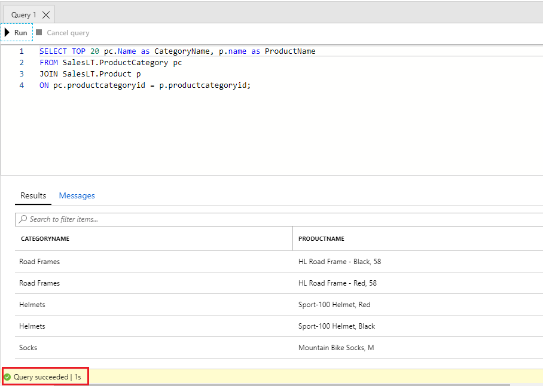

<div id="readme" class="Box-body readme blob js-code-block-container p-5 p-xl-6 gist-border-0" dir="rtl">
    <article class="markdown-body entry-content container-lg" itemprop="text"><table>
  <thead>
  <tr>
  <th>wts</th>
  </tr>
  </thead>
  <tbody>
  <tr>
  <td><div><table>
  <thead>
  <tr>
  <th>title</th>
  <th>module</th>
  </tr>
  </thead>
  <tbody>
  <tr>
  <td><div>06 - إنشاء قاعدة بيانات SQL (5 دقائق)</div></td>
  <td><div>الوحدة 02 - خدمات Azure الأساسية (أحمال العمل)</div></td>
  </tr>
  </tbody>
</table>
</div></td>
  </tr>
  </tbody>
</table>

# 06 - إنشاء قاعدة بيانات SQL

في هذه المعاينة، سننشئ قاعدة بيانات SQL في Azure ثم نستعلم عن البيانات الموجودة في قاعدة البيانات هذه.

# المهمة 1: إنشاء قاعدة البيانات (5 دقائق)

في هذه المهمة، سننشئ قاعدة بيانات SQL بناءً على قاعدة بيانات عينة AdventureWorksLT. 

1. سجّل الدخول إلى مدخل Azure [**https://portal.azure.com**](https://portal.azure.com).

2. من نافذة **جميع الخدمات**، ابحث عن **قاعدة بيانات SQL** وحددها، ثم انقر فوق **+ إضافة أو + إنشاء أو + جديد**. 

3. في علامة تبويب **الأساسيات**، اكتب هذه المعلومات.  

    | الإعداد | القيمة | 
    | --- | --- |
    | الاشتراك | **اختر اشتراكك** |
    | مجموعة الموارد | **myRGDb** (إنشاء جديد) |
    | اسم قاعدة البيانات| **db1** | 
    | | |

3. بجوار القائمة المنسدلة **الخادم**، انقر فوق **إنشاء جديد** وأدخل هذه المعلومات (استبدل **xxxx** في اسم الخادم بأحرف وأرقام بحيث يكون الاسم فريدًا بشكلٍ عام). انقر فوق **موافق** عند الانتهاء.

    | الإعداد | القيمة | 
    | --- | --- |
    | اسم الخادم | **sqlserverxxxx** (يجب أن يكون فريدًا) | 
    | تسجيل دخول مشرف الخادم | **مستخدم SQL** |
    | كلمة المرور | **Pa$$w0rd1234** |
    | الموقع | **(الولايات المتحدة) شرق الولايات المتحدة** |
    | السماح لخدمات Azure بالوصول إلى الخادم| ***حدد خانة الاختيار*** |
    | | |

   

4. انتقل إلى علامة تبويب **الشبكة** وكوّن الإعدادات التالية (اترك الإعدادات الأخرى في قيمها الافتراضية) 

    | الإعداد | القيمة | 
    | --- | --- |
    | طريقة الاتصال | **نقطة النهاية العامة** |    
    | السماح لخدمات وموارد Azure بالوصول إلى هذا الخادم | **نعم** |
    | أضف عنوان IP الحالي للعميل | **لا** |
    | | |
    
   

5. انتقل إلى علامة تبويب **إعدادات إضافية**. سنستخدم قاعدة بيانات عينة AdventureWorksLT.

    | الإعداد | القيمة | 
    | --- | --- |
    | استخدم البيانات الموجودة | **نموذج** |
    | الترتيب | ***استخدم الإعدادات الافتراضية*** |
    | تمكين Azure Defender لـ SQL | **ليس الان** |
    | | |

    

6. انقر فوق **مراجعة + إنشاء** ثم انقر فوق **إنشاء** لتوزيع وتوفير مجموعة الموارد والخادم وقاعدة البيانات. يمكن أن يستغرق الأمر من 2 إلى 5 دقائق تقريبًا للتوزيع.

7. انتقل إلى علامة تبويب الموارد لتحديد موقع قاعدة بيانات SQL التي أنشأتها. قد تحتاج إلى التحديث.

# المهمة 2: اختبار قاعدة البيانات.

في هذه المهمة، سنكوّن خادم SQL ونُجري استعلام SQL. 

1. من نافذة **جميع الخدمات**، ابحث عن **قواعد بيانات SQL** وحددها وتأكد من إنشاء قاعدة البيانات الجديدة. قد تحتاج إلى **تحديث** الصفحة.

    

2. انقر فوق إدخال **db1** الذي يمثل قاعدة بيانات SQL التي أنشأتها، ثم انقر فوق **محرر Power Query (إصدار أولي)**.

3. تسجيل الدخول **كمستخدم SQL** باستخدام كلمة المرور **Pa$$w0rd1234**.

4. لن تتمكن من تسجيل الدخول. اقرأ الخطأ جيدًا ودَوِّن عنوان IP الذي يجب السماح به من خلال جدار الحماية. 

    

5. من نافذة **db1**، انقر فوق **نظرة عامة**. 

    

6. من نافذة **نظرة عامة** لخادم SQL، انقر فوق **تعيين جدار حماية للخادم**.

7. انقر فوق **إضافة عنوان IP للعميل** (شريط القائمة العلوي) لإضافة عنوان IP المشار إليه في الخطأ. تأكد من **حفظ** تغييراتك. 

    

8. ارجع إلى قاعدة بيانات SQL وصفحة تسجيل الدخول إلى **محرر Power Query (إصدار أولي)**. حاول تسجيل الدخول مرة أخرى **كمستخدم SQL** باستخدام كلمة المرور **Pa$$w0rd1234**. ينبغي أن تنجح هذه المرة. لاحظ أن توزيع قاعدة جدار الحماية الجديدة قد يستغرق دقيقتين. 

9. بمجرد تسجيل الدخول بنجاح، يظهر جزء الاستعلام، أدخل الاستعلام التالي في جزء المحرر.

    ```SQL
    SELECT TOP 20 pc.Name as CategoryName, p.name as ProductName
    FROM SalesLT.ProductCategory pc
    JOIN SalesLT.Product p
    ON pc.productcategoryid = p.productcategoryid;
    ```

    

10. انقر فوق **تشغيل**، ثم راجع نتائج الاستعلام في جزء **النتائج**. ينبغي إجراء الاستعلام بنجاح.

    

تهانينا! لقد أنشأتَ قاعدة بيانات SQL في Azure واستعلمتَ عن البيانات الموجودة في قاعدة البيانات هذه بنجاح.

**ملاحظة**: لتجنب التكاليف الإضافية، يمكنك إزالة مجموعة الموارد هذه. ابحث عن مجموعات الموارد، وانقر فوق مجموعة الموارد الخاصة بك، ثم انقر فوق **حذف مجموعة الموارد**. تحقق من اسم مجموعة الموارد ثم انقر فوق **حذف**. راقب **الإعلامات** لترى كيف تجري عملية الحذف.
