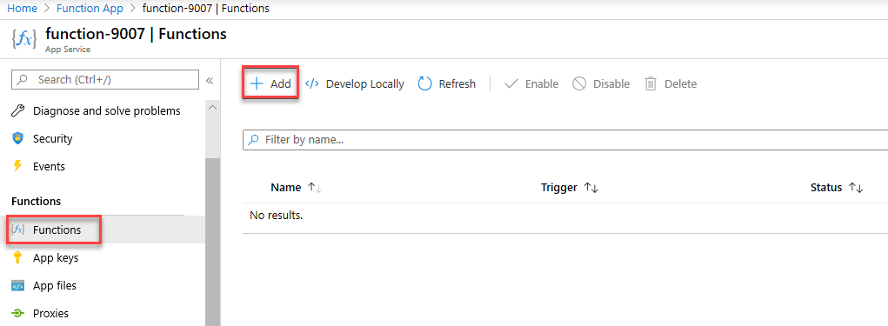
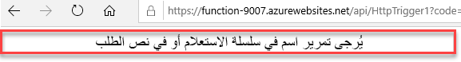
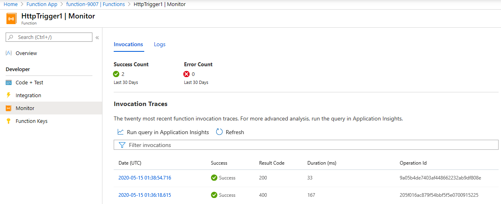

    <article class="markdown-body entry-content container-lg" itemprop="text"><table>
  <thead>
  <tr>
  <th>wts</th>
  </tr>
  </thead>
  <tbody>
  <tr>
  <td>
<table>
  <thead>
  <tr>
  <th>title</th>
  <th>module</th>
  </tr>
  </thead>
  <tbody>
  <tr>
  <td>
08 - تنفيذ وظيفة Azure Functions (5 دقائق)
</td>
  <td>
الوحدة 03: وصف الحلول الأساسية وأدوات الإدارة
</td>
  </tr>
  </tbody>
</table>

</td>
  </tr>
  </tbody>
</table>
       
# 08 - تنفيذ وظيفة Azure Functions (5 دقائق)

في هذه المعاينة، سننشئ تطبيق وظائف لعرض رسالة مرحبًا في حالة وجود طلب HTTP. 

# المهمة 1: قم بإنشاء تطبيق وظائف 

في هذه المهمة، سننشئ تطبيق وظائف.

1. تسجيل الدخول إلى [مدخل Azure](https://portal.azure.com).

2. في مربع نص **البحث** أعلى المدخل، ابحث عن **تطبيق الوظائف** وحدده، ثم من نافذة **تطبيق الوظائف**، انقر فوق **+ إضافة**، **+ إنشاء**، **+ جديد**.

3. في علامة تبويب **أساسي** من نافذة **تطبيق الوظائف**، حدد الإعدادات التالية (استبدل **xxxx** في اسم الوظيفة بأحرف وأرقام بحيث يكون الاسم فريدًا بشكل عام واترك جميع الإعدادات الأخرى في قيمها الافتراضية). 

    | إعدادات | القيمة |
    | -- | --|
    | الاشتراك | **احتفظ بالإعداد الافتراضي المقدم** |
    | مجموعة الموارد | **أنشئ مجموعة موارد جديدة** |
    | اسم تطبيق الوظائف | **function-xxxx** |
    | النشر | **الكود** |
    | مكدس وقت التشغيل | **الشبكة** |
    | الإصدار | **3.1** |
    | المنطقة | **شرق الولايات المتحدة** |

    **ملحوظة** -  تذكر تغيير **xxxx** بحيث بكوّن **اسم تطبيق الوظائف** فريدًا

4. انقر فوق **مراجعة + إنشاء**، وبعد التحقق من الصحة بنجاح، انقر فوق **إنشاء** لبدء توفير وتوزيع تطبيق الوظائف الجديد من Azure.

5. انتظر إعلامًا بإنشاء المورد.

6. عند اكتمال التوزيع، انقر فوق الانتقال إلى المورد من نافذة التوزيع. بدلًا من ذلك، انتقل مرة أخرى إلى نافذة **تطبيق الوظائف**، وانقر فوق **تحديث** وتحقق من أن تطبيق الوظائف الذي تم إنشاؤه حديثًا في حالة **تشغيل**. 

    

# المهمة 2: إنشاء وظيفة HTTP المشغّلة واختبارها

في هذه المهمة، سنستخدم وظيفة خطاف الويب + واجهة برمجة التطبيقات لعرض رسالة في حالة وجود طلب HTTP. 

1. في نافذة **تطبيق الوظائف**، انقر فوق تطبيق الوظائف الذي تم إنشاؤه حديثًا. 

2. في نافذة تطبيق الوظائف، في قسم **الوظائف**، انقر فوق **الوظائف**، ثم انقر فوق **+ إضافة**، **+ إنشاء**، **+ جديد**.

    

3. ستظهر النافذة المنبثقة **إضافة وظيفة** على اليمين. في قسم **تحديد قالب**، انقر فوق **مشغل HTTP**. انقر فوق **إضافة** 

    

4. في نافذة **HttpTrigger1**، في قسم **المطور**، انقر فوق **كود + اختبار**. 

5. في نافذة **كود + اختبار**، راجع الكود الذي تم إنشاؤه تلقائيًا ولاحظ أن الكود مصمم لتشغيل طلب HTTP ومعلومات السجل. لاحظ أيضًا أن الوظيفة تُرجِع رسالة مرحبًا باسم. 

    

6. انقر فوق **الحصول على عنوان URL للوظيفة** من القسم العلوي لمحرر الوظائف. 

7. تأكد من تعيين القيمة الموجودة في القائمة المنسدلة **المفتاح** على الإعداد **الافتراضي** وانقر فوق **نسخ** لنسخ عنوان URL الخاص بالوظيفة. 

    

8. افتح علامة تبويب جديدة في المستعرض والصق عنوان URL الخاص بالوظيفة المنسوخة في شريط عنوان مستعرض الويب. سيتم تشغيل الوظيفة عندما يتم طلب الصفحة. لاحظ الرسالة التي تم إرجاعها والتي تفيد بأن الوظيفة تتطلب اسمًا في نص الطلب.

    

9. ألحِق **&name=*yourname*** بنهاية عنوان URL.

    **ملاحظة**: على سبيل المثال، إذا كان اسمك هو Cindy، فسيكون عنوان URL النهائي مشابهًا لما يلي: `https://azfuncxxx.azurewebsites.net/api/HttpTrigger1?code=X9xx9999xXXXXX9x9xxxXX==&name=cindy`

    

10. عندما تضغط على "إدخال"، تعمل وظيفتك ويتم تتبع كل استدعاء. لعرض عمليات التتبع، ارجع إلى نافذة **HttpTrigger1 \| كود + اختبار** بالمدخل وانقر فوق **المراقب**. يمكنك **تكوين** Application Insights عن طريق تحديد الطابع الزمني والنقر فوق **تشغيل الاستعلام في Application Insights**.

     

تهانينا! لقد أنشأتَ تطبيق وظائف لعرض رسالة مرحبًا في حالة وجود طلب HTTP. 

**ملاحظة**: لتجنب التكاليف الإضافية، يمكنك إزالة مجموعة الموارد هذه اختياريًا. ابحث عن مجموعات الموارد، وانقر فوق مجموعة الموارد الخاصة بك، ثم انقر فوق **حذف مجموعة الموارد**. تحقق من اسم مجموعة الموارد ثم انقر فوق **حذف**. راقب **الإعلامات** لترى كيف تجري عملية الحذف.
