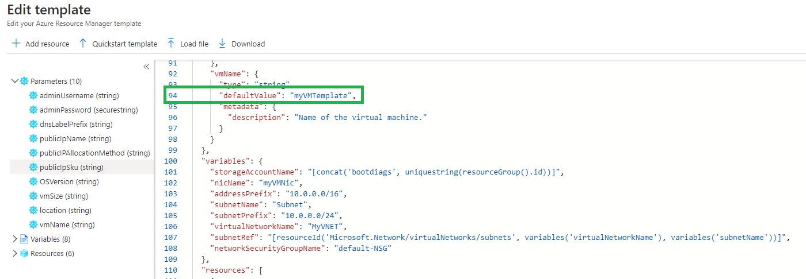
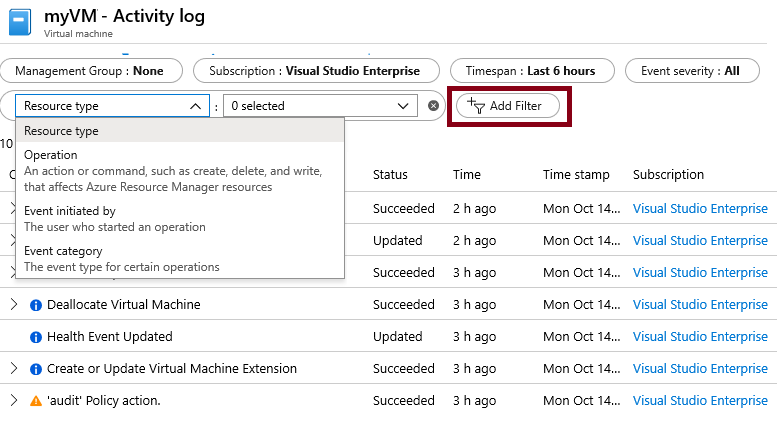

---
wts:
   title: '09 - إنشاء جهاز ظاهري باستخدام قالب (10 دقائق)'
   module: 'الوحدة 03: وصف الحلول الأساسية وأدوات الإدارة'
---
# 09- إنشاء جهاز ظاهري باستخدام قالب

في هذه المعاينة، سنوزع جهازًا ظاهريًا مع قالب QuickStart ونفحص إمكانات المراقبة.

# المهمة 1: استكشاف المعرض وتحديد موقع قالب (10 دقائق)

في هذه المهمة، نستعرض معرض Azure QuickStart ونوزع قالبًا يُنشئ جهازًا ظاهريًا. 

1. في المستعرض، قم بالوصول إلى [معرض قوالب Azure Quickstart](https://azure.microsoft.com/resources/templates?azure-portal=true). ستجد في المعرض عددًا من القوالب الشائعة والتي تم تحديثها مؤخرًا. تعمل هذه القوالب على أتمتة توزيع موارد Azure، بما في ذلك تثبيت حزم البرامج الشائعة.

2. استعرض العديد من أنواع القوالب المختلفة المتوفرة. 

    **ملاحظة**: هل هناك أي قوالب تستحوذ على اهتمامك؟

3. ابحث عن قالب [توزيع جهاز ظاهري](https://azure.microsoft.com/resources/templates/101-vm-simple-windows?azure-portal=true) أو قم بالوصول إليه بشكلٍ مباشر.

    **ملاحظة**: يمكّنك زر **توزيع على Azure** من توزيع القالب عبر مدخل Azure. أثناء هذا التوزيع، ستتم مطالبتك فقط بمجموعة صغيرة من معلمات التكوين. 

4. انقر فوق زر **توزيع على Azure**. ستتم إعادة توجيه جلسة المستعرض تلقائيًا إلى [مدخل Azure](http://portal.azure.com/).

5. سجّل الدخول باشتراك Azure الذي تريد استخدامه في هذا المعمل، إذا طُلب منك ذلك.

6. انقر فوق **تحرير القالب**. يستخدم تنسيق قالب إدارة الموارد تنسيق JSON. راجع المعلمات والمتغيرات.  ثم حدد موقع معلمة اسم الجهاز الظاهري. غيّر الاسم إلى **myVMTemplate**. **احفظ** التغييرات. ستتم إعادتك إلى نافذة **التوزيع المخصص** في مدخل Azure.

    

7. في نافذة **التوزيع المخصص**، كوّن المعلمات المطلوبة من قِبل القالب (استبدل ***xxxx*** في بادئة تسمية DNS بأحرف وأرقام بحيث تكون التسمية فريدة بشكلٍ عام). اترك الإعدادات الافتراضية لكل شيء آخر. 

    | الإعداد| القيمة|
    |----|----|
    | الاشتراك | **اختر اشتراكك**|
    | مجموعة الموارد | **myRGTemplate** (إنشاء جديد) |
    | الموقع | **(الولايات المتحدة) شرق الولايات المتحدة** |
    | اسم مستخدم المسؤول | **مستخدم Azure** |
    | كلمة مرور المسؤول | **Pa$$w0rd1234** |
    | بادئة تسمية DNS | **myvmtemplate*xxxx*** |
    | إصدار نظام التشغيل Windows | **ديسمبر 2019** |
    | | |
    
    ** ملاحظة: ليس هناك تكلفة مرتبطة بهذا القالب.

8. انقر فوق **مراجعة + إنشاء**.

9. بمجرد اجتياز التحقق من الصحة، انقر فوق زر **إنشاء**. يمكن أن يستغرق توزيع الجهاز الظاهري ما بين خمس إلى سبع دقائق. 

# المهمة 2: تحقق من توزيع جهاز ظاهري خاص بك وراقبه

في هذه المهمة، سنتحقق من توزيع الجهاز الظاهري بشكل صحيح. 

1. من نافذة **جميع الخدمات**، ابحث عن **الأجهزة الظاهرية** وحددها.

2. تأكد من إنشاء جهازك الظاهري الجديد. 

    

3. حدد جهازك الظاهري وفي جزء **نظرة عامة**، مرر لأسفل لعرض بيانات المراقبة.

    **ملاحظة**: يمكن تعديل الإطار الزمني للمراقبة من ساعة واحدة إلى 30 يومًا.

4. راجع مختلف المخططات المتوفرة بما في ذلك **وحدة المعالجة المركزية (المتوسط)** و**الشبكة (الإجمالي)** و**مساحة القرص (الإجمالي)**. 

    

5. انقر فوق أي مخطط. لاحظ أنه يمكنك **إضافة قياس** وتغيير نوع المخطط.

6. ارجع إلى نافذة **نظرة عامة**.

7. انقر فوق **سجل النشاط** (الجزء الأيسر). تُسجل سجلات النشاط هذه الأحداث مثل إنشاء الموارد أو تعديلها. 

8. انقر فوق **إضافة عامل تصفية**، وجرب البحث عن أنواع وعمليات مختلفة للأحداث. 

    

**ملاحظة**: لتجنب التكاليف الإضافية، يمكنك إزالة مجموعة الموارد هذه. ابحث عن مجموعات الموارد، وانقر فوق مجموعة الموارد الخاصة بك، ثم انقر فوق **حذف مجموعة الموارد**. تحقق من اسم مجموعة الموارد ثم انقر فوق **حذف**. راقب **الإعلامات** لترى كيف تجري عملية الحذف.
