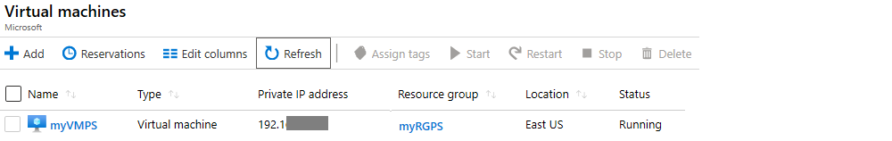

---
wts:
   title: '10 - إنشاء جهاز ظاهري باستخدام PowerShell (10 دقائق)'
   module: 'الوحدة 03: وصف الحلول الأساسية وأدوات الإدارة'
---
# 10 - إنشاء جهاز ظاهري باستخدام PowerShell

في هذا المعاينة، سنكوّن Cloud Shell، ونستخدم وحدة Azure PowerShell لإنشاء مجموعة موارد وجهاز ظاهري ومراجعة توصيات Azure Advisor. 

# المهمة 1: تكوين Cloud Shell (10 دقائق)

في هذه المهمة، سنكوّن Cloud Shell. 

1. تسجيل الدخول إلى [مدخل Azure](https://portal.azure.com).

2. من مدخل Azure، افتح **Azure Cloud Shell** بالنقر فوق الأيقونة الموجودة في الجزء العلوي الأيمن من مدخل Azure.

    

3. إذا كنت قد استخدمت Cloud Shell مسبقًا، فانتقل إلى المهمة التالية. 

4. عندما يُطلب منك تحديد إما **Bash** أو **PowerShell**، حدد **PowerShell**.

5. عندما يُطلب منك ذلك، انقر فوق **إنشاء سعة تخزينية**، وانتظر لحين تهيئة Azure Cloud Shell. 

# المهمة 2: إنشاء مجموعة موارد وجهاز ظاهري

في هذه المهمة، سنستخدم PowerShell لإنشاء مجموعة موارد وجهاز ظاهري.  

1. تأكد من تحديد **PowerShell** في القائمة المنسدلة العلوية اليسرى من جزء Cloud Shell.

2. في جلسة PowerShell، داخل جزء Cloud Shell، أنشئ مجموعة موارد جديدة. 

    ```PowerShell
    New-AzResourceGroup -Name myRGPS -Location EastUS
    ```

3. تحقق من مجموعة الموارد الجديدة الخاصة بك. 

    ```PowerShell
    Get-AzResourceGroup | Format-Table
    ```

4. إنشاء جهاز ظاهري. عندما يُطلب منك ذلك، قدّم اسم المستخدم (**azureuser**) وكلمة المرور (**Pa$$w0rd1234**) التي سيتم تكوينها كحساب المسؤول المحلي على تلك الأجهزة الظاهرية. تأكد من تضمين أحرف التجزئة (`) في نهاية كل سطر باستثناء آخر سطر (ينبغي ألا يكون هناك أي أحرف تجزئة عند كتابة الأمر بأكمله في سطر واحد).

    ```PowerShell
    New-AzVm `
    -ResourceGroupName "myRGPS" `
    -Name "myVMPS" `
    -Location "East US" `
    -VirtualNetworkName "myVnetPS" `
    -SubnetName "mySubnetPS" `
    -SecurityGroupName "myNSGPS" `
    -PublicIpAddressName "myPublicIpPS"
    ```
** انتظر لحين توزيع الجهاز الظاهري قبل إغلاق PowerShell

5. أغلق جزء جلسة Cloud Shell في جلسة PowerShell.

6. في مدخل Azure، ابحث عن **الأجهزة الظاهرية** وتحقق من تشغيل **myVMPS**. قد يستغرق هذا بضع دقائق.

    

7. قم بالوصول إلى الجهاز الظاهري الجديد وراجع النظرة العامة وإعدادات الشبكات للتحقق من توزيع معلوماتك بشكلٍ صحيح. 

# المهمة 3: تنفيذ الأوامر في Cloud Shell

في هذه المهمة، سنتدرب على تنفيذ أوامر PowerShell من Cloud Shell. 

1. من مدخل Azure، افتح **Azure Cloud Shell** بالنقر فوق الأيقونة الموجودة في الجزء العلوي الأيمن من مدخل Azure.

2. تأكد من تحديد **PowerShell** في القائمة المنسدلة العلوية اليسرى من جزء Cloud Shell.

3. استرد معلومات عن جهازك الظاهري بما في ذلك الاسم ومجموعة الموارد والموقع والحالة. لاحظ أن PowerState **قيد التشغيل**.

    ```PowerShell
    Get-AzVM -name myVMPS -status | Format-Table -autosize
    ```

4. أوقف الجهاز الظاهري. عندما يُطلب منك تأكيد (نعم) على الإجراء. 

    ```PowerShell
    Stop-AzVM -ResourceGroupName myRGPS -Name myVMPS
    ```

5. تحقق من حالة جهازك الظاهري. ينبغي الآن إلغاء تخصيص **PowerState**. يمكنك أيضًا التحقق من حالة الجهاز الظاهري في المدخل. 

    ```PowerShell
    Get-AzVM -name myVMPS -status | Format-Table -autosize
    ```

# المهمة 4: راجع توصيات Azure Advisor

**ملاحظة:** هذه المهمة نفسها موجودة في معمل إنشاء جهاز ظاهري باستخدام Azure CLI. 

في هذه المهمة، سنراجع توصيات Azure Advisor لجهازنا الظاهري. 

1. من نافذة **جميع الخدمات**، ابحث عن **Advisor** وحدده. 

2. في نافذة **Advisor**، حدد **نظرة عامة**. يتم تجميع توصيات الإعلامات حسب قابلية الوصول العالية والأمان والأداء والتكلفة. 

    

3. حدد **جميع التوصيات** استغرق الوقت الكافي لعرض كل توصية والإجراءات المقترحة. 

    **ملاحظة:** اعتمادًا على مواردك، ستكون توصياتك مختلفة. 

    

4. لاحظ أنه يمكنك تنزيل التوصيات كملف بتنسيق CSV أو PDF. 

5. لاحظ أنه يمكنك إنشاء تنبيهات. 

6. إذا كان لديك الوقت الكافي، فاستمر في تجربة Azure PowerShell. 

تهانينا! لقد كوّنت Cloud Shell وأنشأتَ جهاز ظاهري باستخدام PowerShell وتدربتَ على أوامر PowerShell واستعرضتَ توصيات Advisor.

**ملاحظة**: لتجنب التكاليف الإضافية، يمكنك إزالة مجموعة الموارد هذه. ابحث عن مجموعات الموارد، وانقر فوق مجموعة الموارد الخاصة بك، ثم انقر فوق **حذف مجموعة الموارد**. تحقق من اسم مجموعة الموارد ثم انقر فوق **حذف**. راقب **الإعلامات** لترى كيف تجري عملية الحذف.
