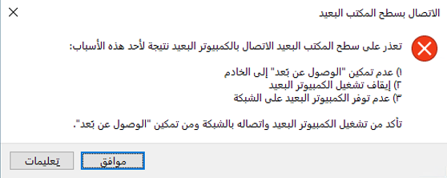



    <article class="markdown-body entry-content container-lg" itemprop="text"><table>
  <thead>
  <tr>
  <th>wts</th>
  </tr>
  </thead>
  <tbody>
  <tr>
  <td>
<table>
  <thead>
  <tr>
  <th>title</th>
  <th>module</th>
  </tr>
  </thead>
  <tbody>
  <tr>
  <td>
13 - تأمين حركة مرور الشبكة (10 دقائق)
</td>
  <td>
الوحدة 04: وصف ميزات الأمان العامة وأمان الشبكة
</td>
  </tr>
  </tbody>
</table>

</td>
  </tr>
  </tbody>
</table>
       
# 13 - تأمين نسبة استخدام الشبكة (10 دقائق)

في هذه المعاينة، سنكوّن مجموعة أمان الشبكة.

# المهمة 1: إنشاء جهاز ظاهري

في هذه المهمة، سننشئ جهازًا ظاهريًا لمركز بيانات Windows Server 2019. 

1. تسجيل الدخول إلى [مدخل Azure](https://portal.azure.com).

2. من نافذة **كل الخدمات**، ابحث عن **الأجهزة الظاهرية** وحددها، ثم انقر فوق **+ إضافة، + إنشاء، + جديد** جهاز ظاهري.

3. في علامة تبويب **الأساسيات**، اكتب المعلومات التالية (اترك الإعدادات الافتراضية لكل شيء آخر):

    | إعدادات | القيم |
    |  -- | -- |
    | الاشتراك | **ستخدم الإعداد الافتراضي المقدم** |
    | مجموعة الموارد | **أنشئ مجموعة موارد جديدة** |
    | اسم الجهاز الظاهري | **SimpleWinVM** |
    | المنطقة | **(الولايات المتحدة) شرق الولايات المتحدة**|
    | الصورة | **مركز بيانات Windows Server 2019 - Gen 2**|
    | الحجم | **D2s v3 قياسي**|
    | اسم مستخدم حساب المسؤول | **azureuser** |
    | كلمة مرور حساب المسؤول | **Pa$$w0rd1234**|
    | قواعد منفذ الوارد | **لا يوجد**|

4. قم بالتبديل إلى علامة تبويب **الشبكة**، وكوّن الإعداد التالي:

    | إعدادات | القيم |
    | -- | -- |
    | مجموعة أمان شبكة NIC | **لا يوجد**|

5. قم بالتبديل إلى علامة تبويب **الإدارة**، وفي قسم **المراقبة** ضمنها، حدد الإعداد التالي:

    | إعدادات | القيم |
    | -- | -- |
    | سجل تشخيص التمهيد | **تعطيل**|

6. اترك الإعدادات الافتراضية المتبقية ثم انقر فوق زر **مراجعة + إنشاء** في أسفل الصفحة.

7. بمجرد اجتياز التحقق من الصحة، انقر فوق زر **إنشاء**. قد يستغرق توزيع الجهاز الظاهري نحو خمس دقائق.

8. راقب التوزيع. قد يستغرق إنشاء مجموعة الموارد والجهاز الظاهري بضع دقائق. 

9. من نافذة التوزيع أو من منطقة الإعلامات، انقر فوق **الانتقال إلى المورد**. 

10. في نافذة الجهاز الظاهري **SimpleWinVM**، انقر فوق **الشبكة**، وراجع علامة تبويب **قواعد منفذ الوارد**، ولاحظ عدم وجود مجموعة أمان شبكة مرتبطة بواجهة الشبكة الخاصة بالجهاز الظاهري أو الشبكة الفرعية التي تتصل بها واجهة الشبكة.

    **ملاحظة**: حدد اسم واجهة الشبكة. ستحتاجه في المهمة التالية.

# المهمة 2: إنشاء مجموعة أمان للشبكة

في هذه المهمة، سننشئ مجموعة أمان للشبكة ونربطها بواجهة الشبكة.

1. من نافذة **كل الخدمات**، ابحث عن **مجموعات أمان الشبكة** وحددها، ثم انقر فوق **+ إضافة،+ إنشاء، + جديد**

2. في علامة تبويب **الأساسيات** في نافذة **إنشاء مجموعة أمان الشبكة**، حدد الإعدادات التالية.

    | الإعداد | القيمة |
    | -- | -- |
    | الاشتراك | **استخدم الاشتراك المقدم** |
    | مجموعة الموارد | **حدد "افتراضي" في القائمة المنسدلة** |
    | الاسم | **myNSGSecure** |
    | المنطقة | **(الولايات المتحدة) شرق الولايات المتحدة**  |

3. انقر فوق **مراجعة + إنشاء**، ثم انقر فوق **إنشاء** بعد التحقق من الصحة.

4. بعد إنشاء مجموعة أمان الشبكة، انقر فوق **الانتقال إلى المورد**.

5. ضمن **الإعدادات**، انقر فوق **واجهات الشبكة** ثم **إقران**.

6. حدد واجهة الشبكة التي حددتها في المهمة السابقة. 

# المهمة 3: تكوين قاعدة منفذ أمان وارد للسماح بـ RDP

في هذه المهمة، سنسمح بنسبة استخدام شبكة RDP إلى الجهاز الظاهري عن طريق تكوين قاعدة منفذ أمان وارد. 

1. في مدخل Azure، انتقل إلى نافذة الجهاز الظاهري **SimpleWinVM**. 

2. في جزء **نظرة عامة**، انقر فوق **اتصال**.

3. حاول الاتصال بالجهاز الظاهري عن طريق تحديد RDP وتنزيل ملف RDP قيد التشغيل. بشكل افتراضي، لا تسمح مجموعة أمان الشبكة بـ RDP. أغلق نافذة الخطأ. 

    

4. في نافذة الجهاز الظاهري، مرر لأسفل إلى قسم **الإعدادات**، وانقر فوق **الشبكة**، ولاحظ قواعد الوارد لمجموعة أمان الشبكة **myNSGSecure (المرفقة بواجهة الشبكة: myVMNic)** التي ترفض جميع نسب استخدام الشبكة الواردة باستثناء نسبة استخدام الشبكة داخل الشبكة الظاهرية وتحقيقات موازن التحميل.

5. في علامة تبويب **قواعد منفذ الوارد**، انقر فوق **إضافة قاعدة منفذ الوارد**. انقر فوق **إضافة** عند الاكتمال. 

    | الإعداد | القيمة |
    | -- | -- |
    | مصدر | **أي**|
    | نطاقات منفذ المصدر | **\*** |
    | الوجهة | **أي** |
    | نطاقات منفذ الوجهة | **3389** |
    | البروتوكول | **TCP** |
    | الإجراء | **السماح** |
    | الأولوية | **300** |
    | الاسم | **AllowRDP** |

6. حدد **إضافة** وانتظر حتى يتم توفير القاعدة ثم حاول مرة أخرى إلى RDP في الجهاز الظاهري بالرجوع إلى **توصيل**. وهذه المرة ينبغي أن تنجح. تذكر أن المستخدم هو **azureuser** وكلمة المرور هي **Pa$$w0rd1234**.

# المهمة 4: تكوين قاعدة منفذ أمان صادر لحجب الوصول إلى الإنترنت

في هذه المهمة، سننشئ قاعدة منفذ صادر لمجموعة NSG تحجب الوصول إلى الإنترنت ثم نختبرها للتأكد من عمل القاعدة.

1. استمر في جلسة RDP الخاصة بجهازك الظاهري. 

2. بعد بدء تشغيل الجهاز، افتح مستعرض **Internet Explorer**. 

3. تحقق من إمكانية الوصول إلى **https://www.bing.com** ثم أغلق Internet Explorer. ستحتاج إلى العمل من خلال النوافذ المنبثقة للأمان المحسّن في IE. 

    **ملاحظة**: سنكوّن الآن قاعدة لحجب الوصول إلى الإنترنت الصادر. 

4. في مدخل Azure، انتقل مرة أخرى إلى نافذة الجهاز الظاهري **SimpleWinVM**. 

5. ضمن **الإعدادات**، انقر فوق **الشبكة**، ثم **قواعد منفذ الصادر**.

6. لاحظ أن هناك قاعدة، **AllowInternetOutbound**. هذه قاعدة افتراضية ولا يمكن إزالتها. 

7. انقر فوق **إضافة قاعدة منفذ صادر** على يمين مجموعة أمان شبكة **myNSGSecure (المرفقة بواجهة الشبكة: myVMNic)** وكوّن قاعدة أمان صادرة جديدة ذات أولوية أعلى تحجب نسبة استخدام شبكة الإنترنت. انقر فوق **إضافة** عند الانتهاء. 

    | الإعداد | القيمة |
    | -- | -- |
    | مصدر | **أي**|
    | نطاقات منفذ المصدر | **\*** |
    | الوجهة | **علامة الخدمة** |
    | علامة خدمة الوجهة | **الإنترنت** |
    | نطاقات منفذ الوجهة | **\*** |
    | البروتوكول | **TCP** |
    | الإجراء | **الرفض** |
    | الأولوية | **4000** |
    | الاسم | **DenyInternet** |

8. انقر فوق **إضافة** رجوع إلى الجهاز الظاهري RDP. 

9. استعرض الرابط التالي **https://www.microsoft.com**. لا ينبغي عرض الصفحة. قد تحتاج إلى العمل من خلال النوافذ المنبثقة الإضافية للأمان المحسّن في IE.  

**ملاحظة**: لتجنب التكاليف الإضافية، يمكنك إزالة مجموعة الموارد هذه اختياريًا. ابحث عن مجموعات الموارد، وانقر فوق مجموعة الموارد الخاصة بك، ثم انقر فوق **حذف مجموعة الموارد**. تحقق من اسم مجموعة الموارد ثم انقر فوق **حذف**. راقب **الإعلامات** لترى كيف تجري عملية الحذف.
