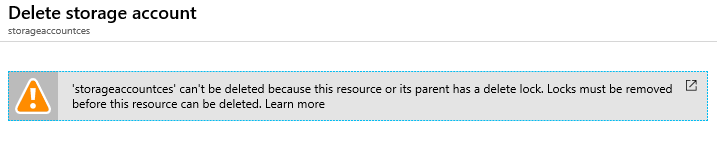

---
wts:
    title: '15 - إدارة أقفال الموارد (5 دقائق)'
    module: 'الوحدة 05: وصف ميزات الهوية والحوكمة والخصوصية والتوافق'
---
# 15 - إدارة أقفال الموارد

في هذه المعاينة، سنضيف قفلًا إلى مجموعة الموارد ونختبر حذف مجموعة الموارد. يمكن تطبيق أقفال في الاشتراك في مجموعات الموارد أو الموارد الفردية لمنع الحذف أو التعديل العرضي للموارد الهامة.  

# المهمة 1: إنشاء مجموعة موارد (5 دقائق)

في هذه المهمة، سننشئ مجموعة موارد لهذا التمرين. 

1. تسجيل الدخول إلى [مدخل Azure](https://portal.azure.com).

2. في شريط **البحث** أعلى المدخل، ابحث عن **مجموعات الموارد**. 

3. ثم انقر فوق **+إضافة +جديد +إنشاء** 

    | الإعداد | القيمة |
    | -- | -- |
    | الاشتراك | **استخدم اشتراكك** |
    | الاسم | **myRGLocks** |
    | المنطقة | **(الولايات المتحدة) شرق الولايات المتحدة** |
    

# المهمة 2:  إضافة قفل إلى مجموعة الموارد واختبار الحذف

في هذه المهمة، سنضيف قفل مورد إلى مجموعة الموارد ونختبر حذف مجموعة الموارد. 

1. في مدخل Azure، انتقل إلى مجموعة الموارد التي تم إنشاؤها حديثًا **myRGLocks**.

2. يمكنك تطبيق قفل على اشتراك أو مجموعة موارد أو مورد فردي لمنع الحذف أو التعديل العرضي للموارد الهامة. 

3. في قسم **الإعدادات**، انقر فوق **الأقفال** ثم انقر فوق **+ إضافة**. 

    

4. تكوين القفل الجديد. عند الانتهاء، انقر فوق **موافق**. 

    | الإعداد | القيمة |
    | -- | -- |
    | اسم القفل | **RGLock** |
    | نوع القفل | **حذف** |
    | | |

5. انقر فوق **نظرة عامة** وانقر فوق **حذف مجموعة الموارد**. اكتب اسم مجموعة الموارد ثم انقر فوق **موافق**. تلقيتَ رسالة خطأ تفيد بأن مجموعة الموارد مقفلة ولا يمكن حذفها.

    

# المهمة 3: اختبار حذف عضو من مجموعة الموارد

في هذه المهمة، سنختبر ما إذا كان قفل المورد يحمي حساب تخزين في مجموعة الموارد أم لا. 

1. من نافذة **جميع الخدمات**، ابحث عن **حسابات التخزين** وحددها، ثم انقر فوق **+ إضافة أو + إنشاء أو + جديد**. 

2. في صفحة **حسابات التخزين** من نافذة **+إضافة +إنشاء +جديد**، اكتب البيانات التالية (استبدل **xxxx** في اسم حساب التخزين بأحرف وأرقام بحيث يكون الاسم فريدًا بشكل عام). اترك الإعدادات الافتراضية لكل شيء آخر.

    | الإعداد | القيمة | 
    | --- | --- |
    | الاشتراك | **حدد اشتراكك** |
    | مجموعة الموارد | **myRGLocks** |
    | اسم حساب التخزين | **storageaccountxxxx** |
    | الموقع | **(الولايات المتحدة) شرق الولايات المتحدة**  |
    | الأداء | **قياسية** |
    | نوع الحساب | **StorageV2 (للأغراض العامة v2)** |
    | نسخ متماثل | **التخزين المتكرر المحلي (LRS)** |
    | مستوى الوصول (افتراضي) | **فعال** |
   

3. انقر فوق **مراجعة + إنشاء** لمراجعة إعدادات حساب التخزين وتمكين Azure من التحقق من صحة التكوين. 

4. بمجرد التحقق، انقر فوق **إنشاء**. انتظر إعلامًا بأن الحساب قد تم إنشاؤه بنجاح. 

5.  انتظر إعلامًا بأن حساب التخزين قد تم إنشاؤه بنجاح. 

6. قم بالوصول إلى حساب التخزين الجديد الخاص بك ومن جزء **نظرة عامة**، انقر فوق **حذف**. تلقيتَ رسالة خطأ تفيد بأن المورد أو أصله لديه قفل حذف. 

    

    **ملاحظة**: رغم أننا لم ننشئ قفلًا على وجه التحديد لحساب التخزين، فقد أنشأنا قفلًا على مستوى مجموعة الموارد، والذي يحتوي على حساب التخزين. على هذا النحو، يمنعنا قفل المستوى *الأصل* هذا من حذف المورد ويكتسب حساب التخزين القفل من الأصل.

# المهمة 4: إزالة قفل المورد

في هذه المهمة، سنزيل قفل المورد ونختبره. 

1. ارجع إلى نافذة مجموعة موارد **myRGLocks-XXXXXXXX**، وفي قسم **الإعدادات**، انقر فوق **الأقفال**.
    
2. انقر فوق **حذف** الارتباط الموجود في أقصى يمين إدخال **myRGLocks-XXXXXXXX**، وإلى يمين **تحرير**.

    

3. ارجع إلى نافذة حساب التخزين وتأكد من أنه يمكنك الآن حذف المورد.

تهانينا! لقد أنشأتَ مجموعة موارد وأضفتَ قفلًا إلى مجموعة الموارد واختبرتَ الحذف واختبرتَ حذف مورد في مجموعة الموارد وأزلتَ قفل المورد. 

**ملاحظة**: لتجنب التكاليف الإضافية، يمكنك إزالة مجموعة الموارد هذه. ابحث عن مجموعات الموارد، وانقر فوق مجموعة الموارد الخاصة بك، ثم انقر فوق **حذف مجموعة الموارد**. تحقق من اسم مجموعة الموارد ثم انقر فوق **حذف**. راقب **الإعلامات** لترى كيف تجري عملية الحذف.
