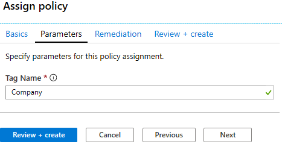

    <article class="markdown-body entry-content container-lg" itemprop="text"><table>
  <thead>
  <tr>
  <th>wts</th>
  </tr>
  </thead>
  <tbody>
  <tr>
  <td>
<table>
  <thead>
  <tr>
  <th>title</th>
  <th>module</th>
  </tr>
  </thead>
  <tbody>
  <tr>
  <td>
16 - הם׀ זײ בַדַ בבדזַֿׁ (5 ֶַֿ)
</td>
  <td>
ַבזֹֽֿ 05: זױ דםַׂ ַבוזםֹ זַבֽזדֹ זַב־ױזױםֹ זַבזַ
</td>
  </tr>
  </tbody>
</table>

</td>
  </tr>
  </tbody>
</table>

# 16 - הם׀ זײ בַדַ בבדזַֿׁ (5 ֶַֿ)

ם ו׀ו ַבדַםהֹ¡ ׃ההװֶ דבםֹ םםה הוּ ״בָ זײ בַדַ זֵהװֱַ ֽ׃ַָ ־ׂםה זַ־ַָׁ ַבבַדַ זׁײ ַבדזַֿׁ ָבַדֹ דֹֽֿֿ זֵַׂבֹ הוּ זײ ַבבַדַ.

# ַבדודֹ 1: ד ֵָהװֱַ םםה הוּ 

ם ו׀ו ַבדודֹ¡ ׃הזרה הוּ **״בָ זײ בַדֹ בל ַבדזַֿׁ** זהםרהו ֵבל ַװַׁהַ. 

1. ׃ּםב ַבֿ־זב ֵבל [דֿ־ב Azure](https://portal.azure.com).

2. דה הַ׀ֹ **ּדם ַב־ֿדַ**¡ ַָֻֽ ה **ַבהוּ** זֽֿֿו.

3. דׁׁ בֳ׃ב ֵבל ׃ד **ַבֳבם**¡ זַהׁ ז **ַבםםהַ**¡ ֻד ַהׁ ז **םםה הוּ** דה ֳבל ַבױֹֽ.

4. בַֽ ֳה **ה״ַ** הוּהַ ׃םזה ַבַװַׁ בל ה״ַ זַ׃. 

5. ײדה **ַבֳ׃ַ׃םַ**¡ ֽֿֿ ׁׂ בַדֹ ֽ׀ **ׁם ַבהוּ** (ַבַּהָ ַבֳםדה דה דָׁ ַבהױ). ם דָׁ **ַבָֻֽ**¡ ֳֿ־ב **בַדֹ** ַבםדֹ. ׃וׁ ֶַדֹ ַָבהץוּ ׀ַ ַבױבֹ ד **בַדֹ** ַבבדֹ. דׁׁ בֳ׃ב ֽל ּֿ ׁם **״בָ זײ בַדֹ בל ַבדזַֿׁ**¡ ַהׁ זו זַהׁ ז **ֽֿםֿ**.

   
   
6. ם בַדֹ ָזםָ **ַבדבדַ**¡ ַָ **ַבװֹׁ** בַ׃ד ַבבַדֹ. ז**Contoso** בבםדֹ. ַהׁ ז **דַֹּׁ + ֵהװֱַ**¡ ֻד **ֵהװֱַ**.

    

7. ֳױָֽ דבםֹ םםה הוּ **״בָ זײ בַדֹ בל ַבדזַֿׁ** ם דַהוַ ַבֲה. הֿ ֵהװֱַ דזֿׁ¡ םָּ ֳה םײדה בַדֹ בדַֽ ַבװֹׁ.
   **דבַֹֽ - בם ַבַהַׁ בדֹֿ 30 ֿםֹ בֽםה ״ָם ַבהוּ.** 

   

# ַבדודֹ 2: ֵהװֱַ ֽ׃ַָ ־ׂםה בַ־ַָׁ זײ ַבבַדַ ַבד״בזָֹ

ם ו׀ו ַבדודֹ¡ ׃ההװֶ ֽ׃ַַָ ־ׂםה בַ־ַָׁ זײ ַבבַדַ ַבד״בזָֹ. 

1. ם דֿ־ב Azure¡ דה הַ׀ֹ **ּדם ַב־ֿדַ**¡ ַָֻֽ ה **ֽ׃ַַָ ַב־ׂםה** זֽֿֿוַ¡ ֻד ַהׁ ז **+ ֵײַֹ + ּֿםֿ + ֵהװֱַ**.

2. ם בַדֹ ָזםָ **ַבֳ׃ַ׃םַ** דה הַ׀ֹ **ֵהװֱַ ֽ׃ַָ ־ׂםה**¡ ַָ ַבָםַהַ ַבַבםֹ (ַ׃ָֿב **xxxx** ם ַ׃ד ֽ׃ַָ ַב־ׂםה ֳָֽׁ זֳַׁד ָֽםֻ םזה ַבַ׃ד ׁםֿנַ ָװב ַד). ַׁ ַבֵַַֿֿ ַבַַׁײםֹ בב װםֱ ֲ־ׁ.

    | ַבֵַֿֿ | ַבםדֹ | 
    | --- | --- |
    | ַבַװַׁ | **׃־ֿד ַבֵַֿֿ ַבַַׁײם ַבדֿד** |
    | דּדזֹ ַבדזַֿׁ | **ֳהװֶ דּדזֹ דזַֿׁ ּֿםֹֿ** |
    | ַ׃ד ֽ׃ַָ ַב־ׂםה | **storageaccountxxxx** |
    | ַבדז | **(ַבזבַםַ ַבדֹֽֿ) װׁ ַבזבַםַ ַבדֹֽֿ** |

3. ַהׁ ז **דַֹּׁ + ֵהװֱַ**. 

    **דבַֹֽ:** הץּׁם ַבַ־ַָׁ בהׁל דַ׀ַ םֻֽֿ ם ַֽבֹ ֿד זםׁ ַבבַדֹ. דבַֹֽ¡ ֿ ם׃ׁ ֿ־זב ַבהוּ ֽםׂ ַבהם׀ דַ םױב ֵבל 30 ֿםֹ.

4. ׃ז בל ׁ׃ַבֹ װב ַבֽ דה ַבױֹֽ. ַהׁ ז ׁ׃ַבֹ **ַהׁ והַ בׁײ ַבַױםב**. ם **הַ׀ֹ ַבֳ־״ֱַ**¡ ם בַדֹ ָזםָ **ַבדב־ױ**¡ בַֽ ׁ׃ַבֹ ַב־״ֳ ַבם םֿ ֳָה ו׀ַ ַבדזֿׁ םׁ ד׃דזֽ ָו דה צָב ַבהוּ.

    **דבַֹֽ:** ֵ׀ַ ׁײף בַדֹ ָזםָ ַב־״ֳ ַבֳזבם¡ ׃ׁל ַ׃ד ַבבַדֹ ַבדֽֿֿ ַבד״בזָ. 

    

5. ֳב ֱּׂ **ַב־״ֳ** זַהׁ ז **ַב׃ַָ** (ֳ׃ב ַבװַװֹ). ֿרד דבזדַ זײ ַבבַדַ. 

    | ַבֵַֿֿ | ַבםדֹ | 
    | --- | --- |
    | ַ׃ד ַבבַדֹ | **ַבװֹׁ** (ֿ בַ זה ם ַבֶַדֹ ַבדה׃ֿבֹ) |

6. ַהׁ ז **דַֹּׁ + ֵהװֱַ** זֽ דה ֵדַד דבםֹ ַבֽ ָהַּֽ. ַהׁ ז **ֵהװֱַ** בזׂם ֽ׃ַָ ַב־ׂםה. 

# ַבדודֹ 3: ׁײ ּדם ַבדזַֿׁ ַבם ֽדב בַדֹ דֹֽֿֿ

1. ם דֿ־ב Azure¡ דה הַ׀ֹ **ּדם ַב־ֿדַ**¡ ַָֻֽ ה **ַבבַדַ** זֽֿֿוַ.

2. בַֽ ב ַבבַדַ זםדוַ. ַהׁ ז **ַבװֹׁ:** ׂזּ םד ַבדַםֽ **Contoso**. ׃םׁײ ו׀ַ הַ׀ֹ ׁײ ֽ׃ַָ ַב־ׂםה ַב׀ם ד ֵהװִַו ֽֿםֻנַ¡ ״ַבדַ ד ָײדםה ַבבַדֹ ֳֻהֱַ זׂםוַ. 

   

3. ם ַבדֿ־ב¡ ַׁײ הַ׀ֹ **ּדם ַבדזַֿׁ**.

4. ַהׁ ז **ֵײַֹ ַדב ױםֹ** זֳײ דַֽ בַדֹ **ַבװֹׁ** ֶֹ ַדב ַבױםֹ. ד ״ָם ַדב ַבױםֹ¡ ׃םד ֵַּֿׁ ֽ׃ַָ ַב־ׂםה ַב־ַױ ָ ״.

    

# ַבדודֹ 4: ֽ׀ דבםֹ םםה ַבהוּ

ם ו׀ו ַבדודֹ¡ ׃הׂםב הוּ **״בָ זײ בַדֹ בל ַבדזַֿׁ** ֽל בַ םִֻׁ בל דבהַ ַבד׃ָבם. 

1. ם ַבדֿ־ב¡ דה הַ׀ֹ **ּדם ַב־ֿדַ**¡ ַָֻֽ ה **ַבהוּ** זֽֿֿו.

2. ַהׁ ז ֵֿ־ַב הוּ **״בָ זײ בַדֹ בל ַבדזַֿׁ**.

3. ַהׁ ז **ֽ׀ ַבםםה** ם ַבֶַדֹ ַבבזםֹ.

4. ֳֿ ָׁ ם ֽ׀ םםה ַבהוּ ם דָׁ ֽזַׁ **ֽ׀ ַבםםה** ַָבהׁ ז **הד**

5. ֵ׀ַ ַה בֿם ַבז ַבַם¡ ֳהװֶ דזֿׁנַ ֲ־ׁ ָֿזה בַדֹ בבֳֿ דה ֳה ַבהוּ בד םֿ ׃ַׁםנַ.

וַהםהַ! ם ו׀ו ַבדַםהֹ¡ ֳהװֳהַ דבםֹ םםה הוּ ״בָ זײ בַדַ זֳהװֳהַ דזֿׁנַ (ֽ׃ַָ ־ׂםה)¡ זַ־ָׁהַ הוּ זײ ַבבַדַ זׁײהַ ַבדזַֿׁ ָבַדֹ דֹֽֿֿ זֳׂבהַ הוּ זײ ַבבַדַ.

**דבַֹֽ**: בּהָ ַבַבם ַבֵײַםֹ¡ םדה ֵַׂבֹ דּדזֹ ַבדזַֿׁ ו׀ו ַ־םַׁםנַ. ַָֻֽ ה דּדזַ ַבדזַֿׁ¡ זַהׁ ז דּדזֹ ַבדזַֿׁ ַב־ַױֹ ָ¡ ֻד ַהׁ ז **ֽ׀ דּדזֹ ַבדזַֿׁ**. ֽ דה ַ׃ד דּדזֹ ַבדזַֿׁ ֻד ַהׁ ז **ֽ׀**. ַָׁ **ַבֵבַדַ** בׁל ם ּׁם דבםֹ ַבֽ׀.